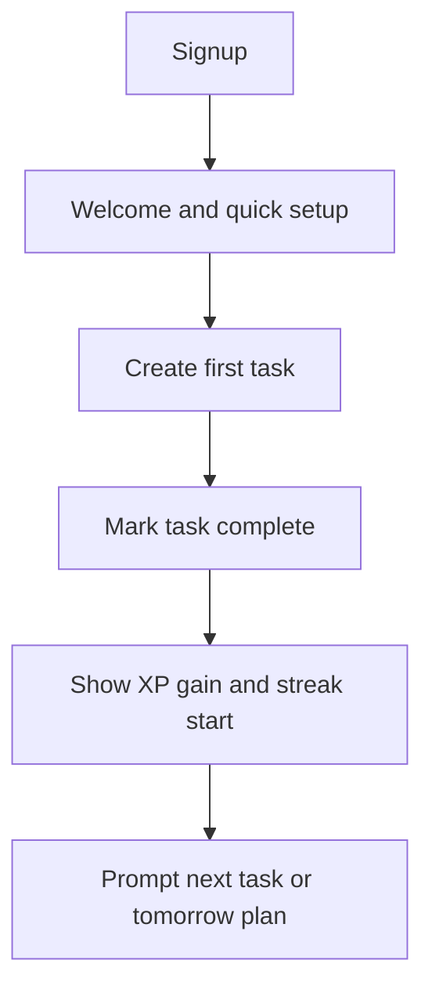
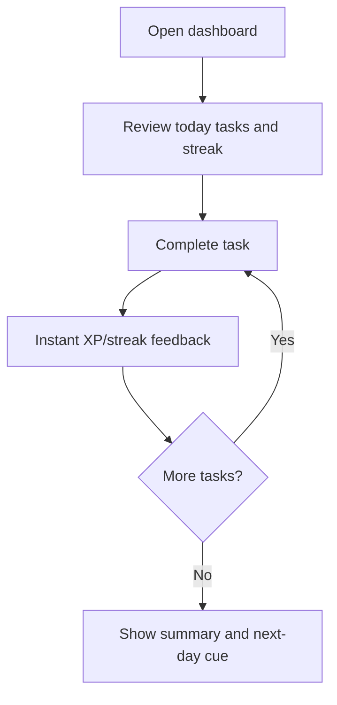
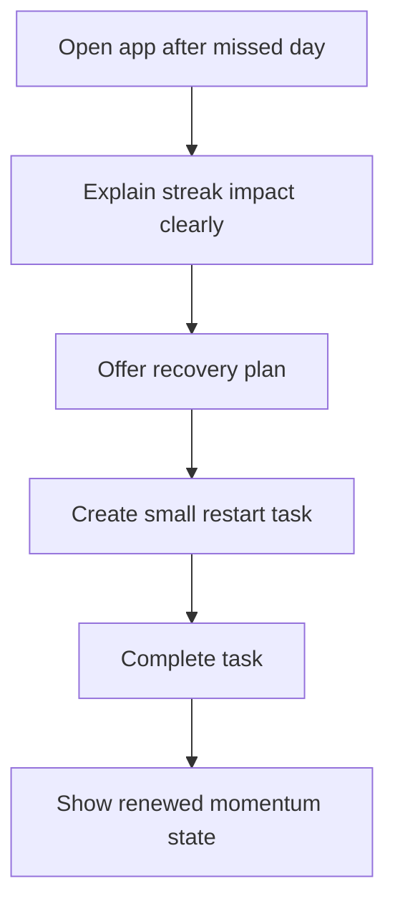

---
stepsCompleted:
  - 1
  - 2
  - 3
  - 4
  - 5
  - 6
  - 7
  - 8
  - 9
  - 10
  - 11
  - 12
  - 13
  - 14
lastStep: 14
inputDocuments:
  - _bmad-output/planning-artifacts/prd.md
  - _bmad-output/planning-artifacts/product-brief-bmad.md
  - _bmad-output/planning-artifacts/product-brief-bmad-distillate.md
---

# UX Design Specification Task Tracker

**Author:** Vitalii
**Date:** 2026-04-24

---

<!-- UX design content will be appended sequentially through collaborative workflow steps -->

## Executive Summary

### Project Vision

Task Tracker is a web application that makes task completion consistent by combining a low-friction task workflow with immediate motivational feedback. The product is designed around a clear execution loop: users create tasks, complete them, earn XP, preserve streaks, and compare momentum through leaderboard views. The UX goal is to keep planning lightweight while making progress feel visible, rewarding, and worth repeating daily.

### Target Users

The primary audience includes students, professionals, and freelancers who already understand what they need to do but struggle with consistency over time. These users value clarity, speed, and reinforcement more than complex planning systems. The design should support both productivity-focused users and motivation-driven users who respond to streaks, progress indicators, and social comparison.

### Key Design Challenges

- Keep the core task flow fast and simple while integrating gamification without cognitive overload.
- Make XP and streak feedback immediate, accurate, and understandable across daily boundaries.
- Balance public motivation features (leaderboards) with comfort for users who may feel discouraged by competition.
- Preserve trust through transparent progress rules so users do not feel the system is arbitrary or unfair.

### Design Opportunities

- Turn every task completion into a momentum moment with instant visual reinforcement.
- Create a first-session path that gets users from signup to first completed task with minimal friction.
- Use streak and weekly progress surfaces to re-engage users before motivation drops.
- Differentiate from traditional task tools by making progress emotionally rewarding without adding enterprise complexity.

## Core User Experience

### Defining Experience

The core experience centers on one primary action: completing a task and instantly seeing meaningful progress feedback. Each completion should trigger an immediate, confidence-building response that confirms the action mattered and moved the user forward. The UX should feel fast, encouraging, and consistent enough that users naturally return to repeat the loop each day.

### Platform Strategy

MVP is a responsive web experience optimized for both desktop and mobile browsers. Desktop supports planning-heavy sessions, while mobile supports quick check-ins and completions throughout the day. Interaction design should prioritize clear tap/click targets, fast state updates, and parity across breakpoints for the core loop.

### Effortless Interactions

- Completing a task should take minimal effort and provide immediate XP/streak confirmation.
- Returning users should see current priority tasks and progress state without navigation friction.
- Daily continuity should be easy to understand, with streak status visible at the moment users decide what to do next.
- Progress updates should feel real-time and unambiguous so users trust the system.

### Critical Success Moments

- First completed task after onboarding with visible XP gain.
- Early streak continuity (days 2-3) where users see momentum forming.
- Recognition moment where users compare progress and feel accountable through leaderboard context.
- Recovery moment after a missed day where users understand next steps and can re-engage quickly.

### Experience Principles

- Prioritize completion over planning complexity.
- Reward immediately, explain clearly, and never delay feedback.
- Keep progress visible at decision points, not hidden behind extra navigation.
- Design motivation features to encourage, not punish.

## Desired Emotional Response

### Primary Emotional Goals

The primary emotional goal is to make users feel empowered and motivated every time they complete meaningful work. Task Tracker should create a sense of forward momentum that reinforces the belief, "I can stay consistent." Secondary goals are clarity and confidence, so users always understand what happened to their XP, streak, and ranking state.

### Emotional Journey Mapping

- First use: Users should feel oriented and capable within the first minute.
- First completion: Users should feel rewarded immediately and eager to repeat the action.
- Daily return: Users should feel momentum, continuity, and low friction to re-engage.
- Setback moments: Users should feel supported, not punished, when a streak is missed.

### Micro-Emotions

- Confidence over confusion through explicit status and feedback.
- Trust over skepticism through deterministic XP/streak behavior.
- Accomplishment over ambiguity through visible progress markers.
- Encouragement over anxiety through constructive recovery messaging.

### Design Implications

- Completion interactions need immediate visual and textual confirmation.
- Streak and XP rules should be transparent near the point of action.
- Leaderboard surfaces should motivate without shaming low-rank users.
- Recovery states should emphasize "next best action" rather than loss.

### Emotional Design Principles

- Reinforce effort instantly.
- Explain progress mechanics clearly.
- Keep motivational feedback personal before social comparison.
- Design recovery as part of the core experience, not an edge case.

## UX Pattern Analysis & Inspiration

### Inspiring Products Analysis

- Todoist: Strong capture speed, clear hierarchy, and low-friction recurring use.
- TickTick: Balanced utility and motivation with practical planning surfaces.
- Habitica: Demonstrates that progression mechanics can sustain engagement.

### Transferable UX Patterns

- Fast-entry patterns: Quick add, keyboard shortcut support, and low-friction defaults.
- Progress visibility patterns: Persistent streak and progress surfaces in dashboard context.
- Reinforcement patterns: Immediate completion feedback with lightweight celebration cues.
- Return-loop patterns: Daily summary and "next action" prompts to reduce re-entry friction.

### Anti-Patterns to Avoid

- Overloaded dashboards that hide core task actions behind dense analytics.
- Reward mechanics that feel inconsistent, delayed, or opaque.
- Competitive surfaces that demotivate lower-performing users.
- Excessive modal interruptions that break the completion flow.

### Design Inspiration Strategy

- Adopt speed and clarity from utility-first tools (Todoist/TickTick).
- Adapt motivational loops from gamified tools (Habitica) without heavy RPG complexity.
- Avoid enterprise-style workflow sprawl to preserve focus on personal consistency.

## Design System Foundation

### 1.1 Design System Choice

Themeable system: Angular Material with custom theming and component extensions.

### Rationale for Selection

- Aligns with Angular frontend direction in project artifacts.
- Accelerates delivery using accessible, tested base components.
- Supports custom brand identity and motivational visual language through theme tokens.

### Implementation Approach

- Use Angular Material primitives for forms, navigation, data display, and overlays.
- Introduce custom wrappers for product-specific interactions (streak cards, XP feedback, leaderboard rows).
- Centralize design tokens (color, type, spacing, motion) for consistency and scalability.

### Customization Strategy

- Create a token layer first, then apply to Material theme configuration.
- Keep component API predictable while styling for Task Tracker personality.
- Use semantic color roles for progress, warning, success, and neutral states.

## 2. Core User Experience (Detailed Interaction Model)

### 2.1 Defining Experience

The defining experience is "complete task, see momentum instantly." This interaction is the product promise made visible and should feel immediate, credible, and repeatable.

### 2.2 User Mental Model

Users think in short execution loops: "What should I do next?", "Did it count?", "Am I still on track?" The interface should map to this mental model by surfacing next actions, immediate outcomes, and continuity state.

### 2.3 Success Criteria

- Users can complete a task in one focused action.
- XP and streak updates are shown within one second of completion.
- Users can explain why their streak changed without guessing.

### 2.4 Novel UX Patterns

Task Tracker primarily uses established productivity patterns with a focused motivational overlay. Innovation should be in reinforcement quality and recovery design, not in unfamiliar interaction primitives.

### 2.5 Experience Mechanics

1. Initiation: user selects a task from today view or quick-add result.
2. Interaction: user marks complete via checkbox/tap target.
3. Feedback: instant XP gain, streak continuity status, and optional subtle celebration.
4. Completion: task moves to completed state and next actionable item is suggested.

## Visual Design Foundation

### Color System

Fresh, balanced foundation (no strict pre-existing brand constraints):

- Primary: deep blue for trust and structure.
- Accent: warm amber for motivation and reward highlights.
- Success: green for completion, streak continuity, and positive outcomes.
- Warning/Error: orange/red for urgent or invalid states.
- Neutral scale: cool grays for hierarchy and readability.

Semantic mapping:
- Primary actions: deep blue.
- Achievement signals: amber/success tones.
- Status and assistive text: neutral ramps.

### Typography System

- Primary typeface: Inter-like humanist sans for readability in dense task UI.
- Scale: clear hierarchy from dashboard title to helper text.
- Body text: optimized for scanability in lists and cards.
- Numeric emphasis: tabular-friendly styling for streaks and counts.

### Spacing & Layout Foundation

- 8px base spacing system.
- Responsive card-and-list layouts with clear section separation.
- Consistent vertical rhythm for task scanning and dashboard sections.
- Desktop supports multi-column context; mobile prioritizes single-column focus.

### Accessibility Considerations

- Minimum WCAG 2.1 AA color contrast.
- Focus-visible states for all interactive controls.
- Non-color indicators for streak/progress changes.
- Minimum 44px touch targets on mobile.

## Design Direction Decision

### Design Directions Explored

Multiple directions were evaluated conceptually: playful gamification-heavy, minimalist utility-heavy, and balanced modern productivity.

### Chosen Direction

Balanced modern productivity with motivational accents.

### Design Rationale

- Preserves task-management clarity for daily execution.
- Keeps motivation visible without overwhelming users.
- Supports broad user segments from practical planners to engagement-driven users.

### Implementation Approach

- Use clean dashboard scaffolding with prominent "today" actions.
- Surface progress modules as secondary but persistent context.
- Apply micro-celebration patterns only at meaningful completion moments.

## User Journey Flows

### Onboarding to First Completion

Users register quickly, add an initial task, and complete it to experience immediate reward.

### Daily Momentum Loop

Returning users review priorities, complete tasks, and maintain streak continuity.

### Missed-Day Recovery Flow

Users who miss a day are guided back into the loop with supportive framing.

### Journey Patterns

- Always show next-best action at the end of a flow.
- Keep feedback immediate and tied to user intent.
- Use clear state transitions to maintain trust.

### Flow Optimization Principles

- Minimize steps between intention and completion.
- Preserve context while updating progress state.
- Design recovery as a first-class pathway.

## Component Strategy

### Design System Components

Base components from Angular Material: buttons, inputs, selects, dialogs, snackbars, tabs, chips, cards, menus, and data tables.

### Custom Components

- Streak Continuity Card: highlights current streak, at-risk status, and next action.
- XP Feedback Toast: immediate reward feedback with concise progression signal.
- Momentum Summary Panel: daily/weekly completion and trend framing.
- Leaderboard Momentum Row: rank, movement delta, and user-safe identity display.
- Recovery Prompt Module: missed-day explanation with actionable restart path.

### Component Implementation Strategy

- Compose custom components from Material primitives.
- Enforce token-driven styling and consistent state behavior.
- Define accessibility requirements per component before implementation.

### Implementation Roadmap

Phase 1: core task list, completion feedback, streak card.
Phase 2: leaderboard row system, momentum panel, recovery module.
Phase 3: enhanced coaching/personalization components.

## UX Consistency Patterns

### Button Hierarchy

- Primary: one main action per view (e.g., complete task, create task).
- Secondary: supportive actions (edit, defer, filter).
- Tertiary/text: low-risk contextual actions.
- Destructive actions always require stronger confirmation patterns.

### Feedback Patterns

- Success: immediate lightweight confirmation near point of action.
- Error: specific, recoverable messaging with next step.
- Warning: proactive guidance before irreversible outcomes.
- Info: brief context without interrupting task flow.

### Form Patterns

- Inline validation with clear field-level guidance.
- Preserve user input on validation failure.
- Use sensible defaults for quick task creation.

### Navigation Patterns

- Persistent primary navigation for core destinations.
- Dashboard-first information hierarchy.
- Mobile bottom navigation for frequent task/progress areas.

### Additional Patterns

- Empty states: action-oriented, never dead-end.
- Loading states: skeletons for key list and dashboard blocks.
- Confirmation patterns: emphasize consequences and recovery.

## Responsive Design & Accessibility

### Responsive Strategy

- Mobile-first foundations with progressive enhancement for larger screens.
- Desktop: multi-pane context for planning and analytics.
- Tablet: touch-optimized layouts with moderate density.

### Breakpoint Strategy

- Mobile: 320-767px
- Tablet: 768-1023px
- Desktop: 1024px+

Custom layout breakpoints may be added based on dashboard complexity and data-density testing.

### Accessibility Strategy

Target WCAG 2.1 AA across all core user journeys.

- Full keyboard operability for task and navigation workflows.
- Screen-reader announcements for completion, XP, and streak changes.
- Contrast and focus policies enforced via design tokens.

### Testing Strategy

- Responsive testing across current iOS/Android and major desktop browsers.
- Automated accessibility audits plus manual keyboard/screen-reader checks.
- Task-flow usability tests including users with diverse accessibility needs.

### Implementation Guidelines

- Prefer semantic HTML and explicit landmark structure.
- Use ARIA only when semantic elements are insufficient.
- Maintain deterministic focus management for dialogs and updates.
- Enforce touch target, contrast, and motion-reduction standards.
